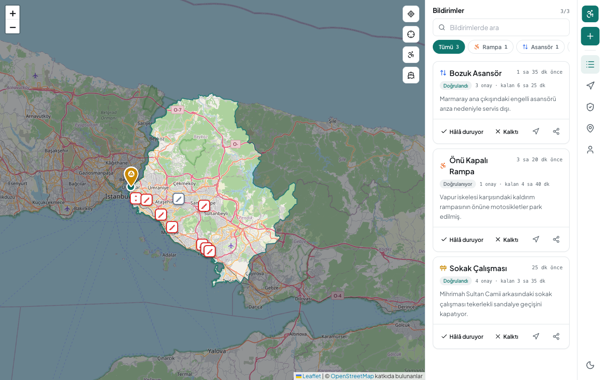
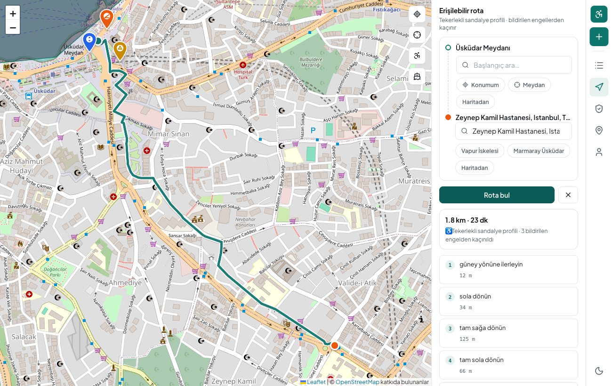
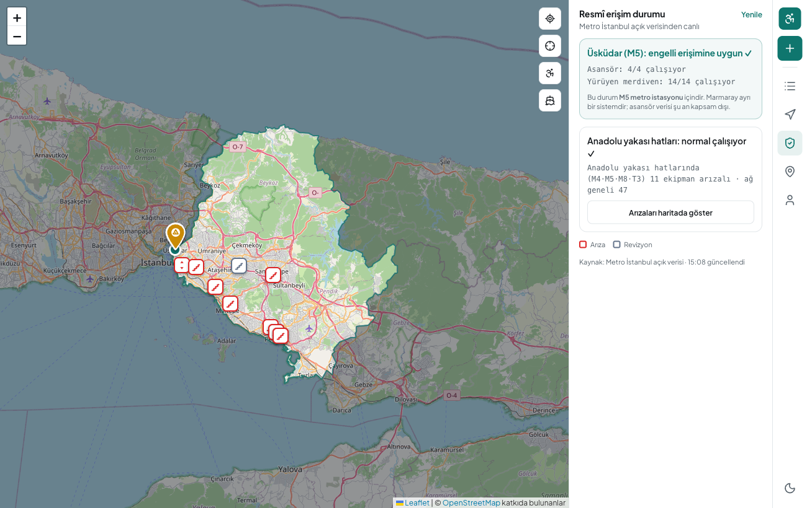
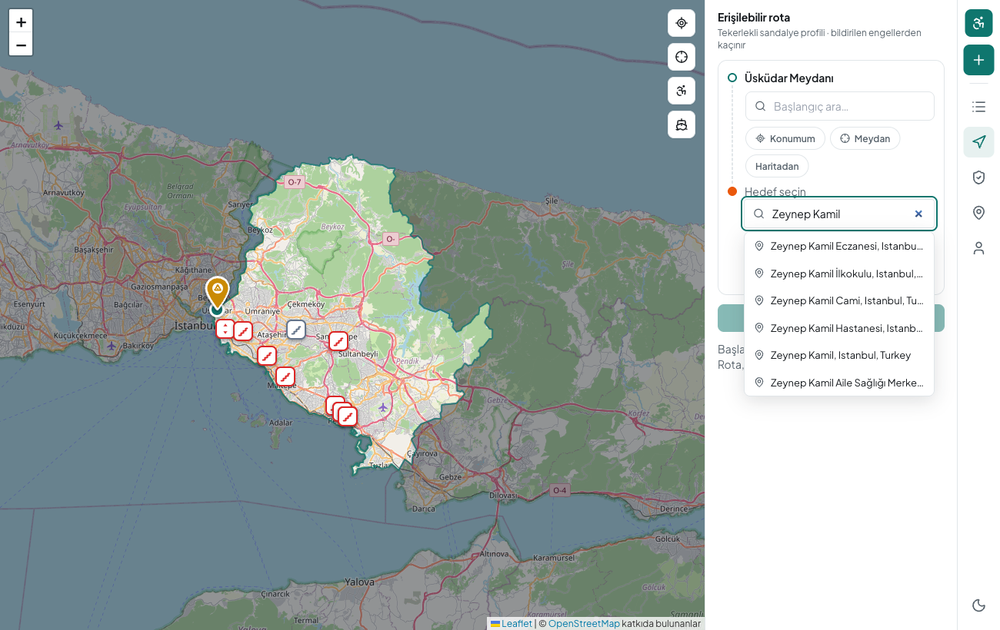
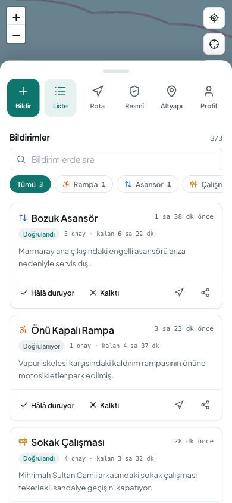
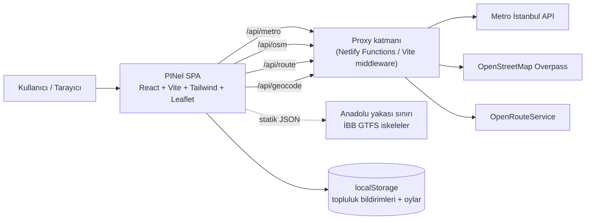
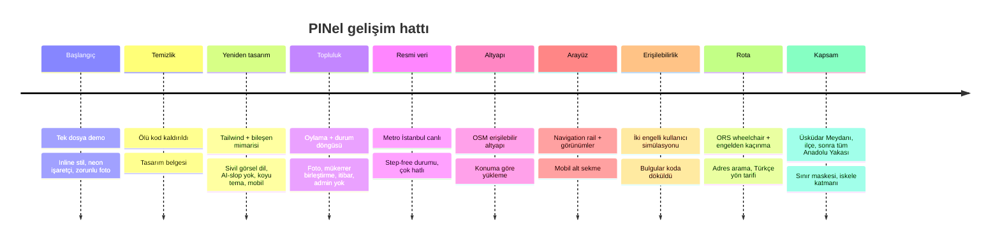

# PINel

İstanbul Anadolu Yakası için canlı erişilebilirlik haritası, topluluk bildirimi ve engelsiz (tekerlekli sandalye) navigasyon platformu.




> Engelli bireylerin (özellikle tekerlekli sandalye ve görme engelli kullanıcıların) şehirde karşılaştığı erişilebilirlik engellerini toplulukla canlı bildirin, resmi açık verilerle görün ve tekerlekli sandalyeye uygun, engellerden kaçınan rota çıkarın.

TRT Geleceğin İletişimcileri, Dijital Ürün Geliştirme kategorisi için geliştirilmiştir.

## İçindekiler

- [Ne yapar](#ne-yapar)
- [Ekran görüntüleri](#ekran-görüntüleri)
- [Veri kaynakları](#veri-kaynakları)
- [Mimari](#mimari)
- [Bu proje nereden nereye geldi](#bu-proje-nereden-nereye-geldi)
- [Kurulum ve çalıştırma](#kurulum-ve-çalıştırma)
- [OpenRouteService anahtarı](#openrouteservice-anahtarı)
- [Netlify'a dağıtım](#netlifya-dağıtım)
- [Bu dalı main'e alma](#bu-dalı-maine-alma)
- [Sonraki adımlar ve öneriler](#sonraki-adımlar-ve-öneriler)
- [Erişilebilirlik ilkeleri](#erişilebilirlik-ilkeleri)
- [Kaynaklar ve atıf](#kaynaklar-ve-atıf)

## Ne yapar

- **Topluluk bildirimi.** Önü kapalı rampa, bozuk asansör, sokak çalışması ve diğer engelleri haritaya ekleyin. Konumunuzdan (GPS), haritaya dokunarak ya da klavyeyle ("merkeze pin bırak") bildirim yapabilirsiniz.
- **Demokratik doğrulama (admin yok).** Her bildirim "Hâlâ duruyor" ve "Kalktı" oylarıyla toplulukça doğrulanır. Yeterli onayla "Doğrulandı" olur; yeterli "kalktı" oyu alınca topluluk tarafından otomatik kaldırılır. Kimse keyfi silemez; herkes kendi bildirimini silebilir.
- **Canlı resmi veri.** Metro İstanbul açık verisinden Anadolu yakası hatlarındaki (M4, M5, M8, T3) bozuk asansör ve yürüyen merdivenler haritada gösterilir. Üsküdar istasyonu için "engelli erişimine uygun mu" canlı kararı verilir (step-free mantığı).
- **Erişilebilir altyapı katmanı.** OpenStreetMap'ten asansör, rampa, indirilmiş kaldırım, hissedilebilir yüzey, erişilebilir tuvalet ve otopark, erişime kapalı yerler. Konuma göre yüklenir; gezdikçe güncellenir.
- **İskele step-free durumu.** İBB GTFS verisinden Anadolu yakası vapur iskeleleri ve tekerlekli sandalye erişim durumu.
- **Engel-farkında tekerlekli sandalye rotası.** OpenRouteService wheelchair profili ile başlangıçtan hedefe rota; bildirilen engellerin etrafından geçer, Türkçe adım adım yön tarifi verir. Hedef ve başlangıç yazarak (adres arama) seçilebilir.
- **Endüstri-standart arayüz.** İkon rail + bağlamsal görünümler (VS Code / harita uygulaması deseni), mobilde alt sekme çubuğu ve açılan panel, açık/koyu tema.
- **Erişilebilir tasarım.** Klavye ile tam kullanım, ekran okuyucu için anlamsal yapı ve aria etiketleri, görünür odak, WCAG AA kontrast, azaltılmış hareket desteği. Yapay zeka klişesi yok: gradient, glow, neon yok; sivil ve net bir görsel dil.
- **Kalıcılık.** Bildirimler tarayıcıda (localStorage) saklanır; yenilemede kaybolmaz. Gerçek zaman damgaları ve kategoriye göre geçerlilik süresi.

## Ekran görüntüleri

| Engel-farkında rota | Resmi erişim durumu |
| --- | --- |
|  |  |

| Adres arama ile hedef | Mobil görünüm |
| --- | --- |
|  |  |

Haritada Anadolu Yakası vurgulanır, yakanın dışı karartılır. Topluluk bildirimleri damla pin, resmi metro arızaları kare, erişilebilir altyapı nokta, iskeleler elmas işaretle gösterilir.

## Veri kaynakları

| Kaynak | Ne sağlar | Erişim | Yükleme |
| --- | --- | --- | --- |
| Metro İstanbul açık API | Bozuk asansör / yürüyen merdiven (M4, M5, M8, T3) | Anahtarsız, proxy ile | Canlı (60 sn cache) |
| OpenStreetMap (Overpass) | Erişilebilir altyapı (rampa, asansör, tuvalet, tactile...) | Anahtarsız, proxy ile | Konuma göre canlı |
| OpenRouteService | Tekerlekli sandalye rotası + adres arama | Ücretsiz anahtar, proxy ile | Canlı |
| İBB GTFS | Vapur iskeleleri step-free durumu | Anahtarsız, statik | Build zamanı |
| OpenStreetMap / Nominatim | Anadolu Yakası ilçe sınırları | Anahtarsız, statik | Build zamanı |
| Topluluk | Kullanıcı bildirimleri ve oylar | localStorage | Anlık |

Gizli anahtar isteyen tek servis OpenRouteService'tir ve anahtar yalnızca sunucu tarafında (proxy) tutulur, tarayıcıya hiç gönderilmez.

## Mimari

Statik bir SPA artı ince serverless proxy katmanı. Proxy'ler CORS engelini aşar, anahtarı saklar ve cache yapar. Aynı çekirdek kod hem prod'da (Netlify Functions) hem yerelde (Vite dev middleware) çalışır.



Proje yapısı kısaca:

```
src/
  App.jsx              durum + düzen orkestrasyonu
  components/
    MapView, Sidebar, ReportModal, ObstacleCard, CategoryBadge, Toast
    views/             ReportsView, RouteView, OfficialView, InfraView, ProfileView
  hooks/               useLocalStorage, useGeolocation
  lib/                 time, geo, mapIcons, status, photo, metro, osm, route, geocode
  data/                obstacleTypes, anadolu-boundary.json, transit-hubs.json
netlify/functions/     metro, osm, route, geocode (+ _core dosyaları) proxy
```

## Bu proje nereden nereye geldi

Başlangıçta tek dosyalık (`main.jsx`) bir hackathon demosuydu: her şey inline stil, neon/pulse "yapay zeka" işaretçiler, zorunlu fotoğraf, yalnızca Üsküdar Meydanı kapsamı ve demo artıkları.



Önemli bir adım, iki engelli persona ile (tekerlekli sandalye kullanan Selin ve ekran okuyucu kullanan görme engelli Ahmet) yürütülen kullanıcı yolculuğu simülasyonuydu. Bu simülasyon, uygulamanın kendi zorunlu fotoğraf kuralının tam da hizmet ettiği kullanıcıları dışladığını ortaya çıkardı; bu ve diğer bulgular (harita işaretçilerine erişilebilir ad, radyo grubu ok tuşları, 44 piksel dokunma hedefleri, görünür başlık) doğrudan koda yansıtıldı.

## Kurulum ve çalıştırma

Gereksinim: Node 18 veya üzeri.

```bash
git clone <repo-url>
cd pinel-accessibility-map
npm install

# Ortam değişkenleri (rota için)
cp .env.example .env
# .env içine ORS_API_KEY değerini yapıştırın (aşağıya bakın)

npm run dev      # geliştirme sunucusu
npm run build    # üretim derlemesi
npm run lint     # kod denetimi
```

`npm run dev` çalışınca tarayıcıda http://localhost:5173 açın.

## OpenRouteService anahtarı

Tekerlekli sandalye rotası ve adres araması OpenRouteService kullanır ve ücretsiz bir anahtar gerektirir.

1. Anahtar ekibinizden e-posta ile size iletilecektir. (Kendiniz almak isterseniz: https://openrouteservice.org/dev adresinden ücretsiz kayıt olup token alabilirsiniz.)
2. Proje kökünde `.env` dosyası oluşturun (`.env.example`'ı kopyalayın) ve anahtarı girin:

   ```
   ORS_API_KEY=buraya_anahtar
   ```

3. `.env` dosyası git'e gönderilmez (gitignore'da) ve anahtar tarayıcıya hiç sızmaz; yalnızca sunucu tarafı proxy kullanır.

Anahtar olmadan da uygulama çalışır: bu durumda rota, tekerlekli sandalye profili yerine anahtarsız yaya rotasına düşer (engellerden kaçınma olmadan). Diğer tüm özellikler anahtarsız çalışır.

## Netlify'a dağıtım

Uygulama statik derlenir ve proxy'ler Netlify Functions olarak çalışır. `netlify.toml` build ve yönlendirmeleri içerir.

1. Repoyu Netlify'a bağlayın (otomatik build).
2. Netlify panelinde Site settings, Environment variables bölümüne `ORS_API_KEY` değişkenini ekleyin.
3. Deploy edin.

Not: GitHub Pages statiktir ve serverless function çalıştıramaz; canlı veri ve rota yalnızca Netlify (veya yerel `npm run dev`) ile çalışır.

## Bu dalı main'e alma

Tüm geliştirme `feat/accessible-redesign` dalındadır ve main'e dokunulmamıştır. İncelemenizden sonra birleştirmek için:

```bash
git checkout main
git pull
git merge feat/accessible-redesign
git push origin main
```

Alternatif olarak GitHub üzerinde bu daldan main'e bir Pull Request açıp inceleyip birleştirebilirsiniz.

## Sonraki adımlar ve öneriler

- **Gerçek backend ve çok kullanıcılı senkron.** Şu an bildirimler tarayıcıda (localStorage) tutulur. Supabase veya Firebase ile gerçek paylaşımlı veri, hesap ve moderasyon kuyruğu eklenebilir.
- **Fotoğraf depolama ve oto-moderasyon.** Fotoğraflar şimdilik yerelde küçültülüp saklanır. Backend ile güvenli depolama, geotag eşleştirme ve uygunsuz içerik denetimi eklenebilir.
- **İtibar ve güven gerçeğe taşınması.** Puan ve "doğrulanmamış" rozeti mantığı, gerçek hesaplarla güven seviyelerine bağlanabilir.
- **Resmi kuruma iletme.** Kritik bildirimler (bozuk asansör gibi) Metro İstanbul veya belediyeye iletilip "çözüldü" döngüsü kapatılabilir (FixMyStreet modeli).
- **Bildirim aboneliği.** "Marmaray asansörü tamir olunca haber ver" gibi bölge veya tesis aboneliği.
- **Daha fazla İBB açık verisi.** GTFS wheelchair_boarding ile istasyon step-free durumu genişletilebilir; trafik/yol çalışması açık verisi (canlı feed için anahtar gerekir) eklenebilir.
- **Çok dillilik.** Ekran okuyucu öncelikli akış zaten var; arayüz İngilizce ve Arapça eklenerek ziyaretçilere açılabilir.
- **PWA.** Sahada çevrimdışı kullanım ve ana ekrana ekleme.

## Erişilebilirlik ilkeleri

Bu bir erişilebilirlik uygulaması olduğu için uygulamanın kendisi de erişilebilir olacak şekilde tasarlandı:

- Klavye ile tam kullanım ve görünür odak halkaları.
- Anlamsal HTML, doğru başlık hiyerarşisi, atla bağlantısı, aria-live duyurular.
- Harita işaretçilerine erişilebilir ad; harita içeriğinin tam metin alternatifi olarak liste görünümü.
- Renk tek başına anlam taşımaz: ikon biçimi ve metin birlikte verilir; WCAG AA kontrast.
- `prefers-reduced-motion` desteği.

## Kaynaklar ve atıf

- Harita döşemeleri: OpenStreetMap katkıda bulunanlar (ODbL).
- Erişilebilir altyapı ve sınırlar: OpenStreetMap / Overpass, Nominatim.
- Asansör ve yürüyen merdiven verisi: Metro İstanbul açık verisi (İBB Açık Veri Lisansı).
- İskele verisi: İBB Public Transport GTFS.
- Rota ve adres arama: OpenRouteService.
- Yazı tipi: Plus Jakarta Sans. İkonlar: Lucide.

PINel, engelsiz bir şehir için topluluk ve resmi veriyi birleştirir.
